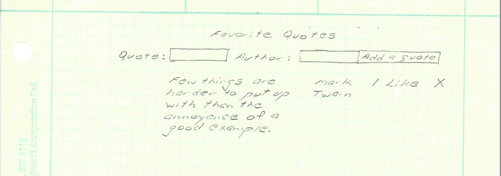

# quotes_api
- When the user opens the app, a page will be displayed to enter a quote and an author.
- The user can then click on the "Add a Quote" button to have the quote and author dipslay on the page.
- The user can click on the "X" to delete the quote.
- The user can click on "Like" to like a quote.
- The user can double click the quote and it grays out to show it has been read.
- If the user double clicks on the quote again, it will become bold once again.

